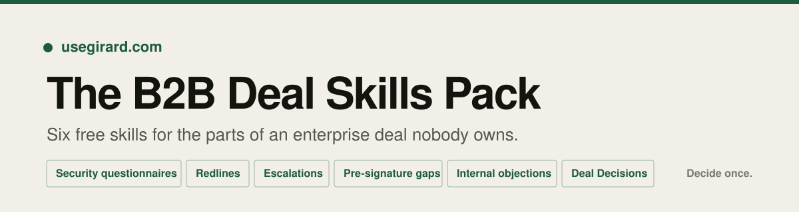

<p align="center">
  
</p>

<p align="center">
  <a href="https://usegirard.com"></a>
  
  
  
</p>

---

A $100K B2B deal takes about 170 days to close. Roughly 70 of those days are internal waiting: security review, redlines, an approval sitting in someone's inbox. The deal was won on the call. The rest is process.

Companies with 20 to 150 people run that process without a deal desk, without in-house counsel, and without a security lead, because none of those roles are affordable yet. These six skills cover the work those roles would do.

Free, MIT licensed, no account, no dependencies. Built by [Girard](https://usegirard.com).

## Install

**Claude Code**

```bash
git clone https://github.com/aman2139/girard-deal-skills.git
mkdir -p .claude/skills
cp -r girard-deal-skills/skills/* .claude/skills/
```

**Claude desktop or web**

Download this repo as a ZIP, then upload the skill folder you want under Settings, Capabilities, Skills. Or run `bash scripts/package.sh` to get one zip per skill in `dist/`.

**Claude Projects**

Add the skill folder to a project so everyone selling in your company gets the same behaviour.

Then just ask in plain English. No commands to memorise:

> Triage this redline against our standard terms.

Full instructions, including what to do when a skill does not trigger, are in [INSTALL.md](INSTALL.md).

## The six skills

| Skill | Use it when | What you get |
| --- | --- | --- |
| [**security-questionnaire-drafter**](skills/security-questionnaire-drafter) | A buyer sends 300 security questions and the only person who can answer them is your CTO | The questionnaire filled in, every answer tagged sourced, derived, or unanswered, plus a list of what must be human-answered before it goes back |
| [**redline-triage**](skills/redline-triage) | Counsel is $600 an hour and you need to know which four clauses are worth their time | Every changed clause sorted into accept, negotiate, escalate, do not sign, with a landing zone you can paste into a reply |
| [**deal-decisions-one-pager**](skills/deal-decisions-one-pager) | Two reps quoted two different discount floors in the same week | One page of what your company has already decided about pricing and terms, with attribution, dates, and the contradictions surfaced |
| [**objection-to-internal-ask**](skills/objection-to-internal-ask) | You forwarded a customer email to your team and got silence back | The same request rewritten as a decision with options, an owner, a date, and a cost of doing nothing. Under 200 words |
| [**escalation-drafter**](skills/escalation-drafter) | A deal needs an exception and you are about to write "quick question" to your CEO | An escalation that reads as a dated decision instead of a question, including the follow-up version when the first one goes unanswered |
| [**late-stage-gap-finder**](skills/late-stage-gap-finder) | You are two days from signature and want to know what procurement will catch | Findings ranked by what they cost to find later, plus every contradiction between the MSA, the order form, the DPA, and what you already told this buyer |

## What it looks like

Real output from `redline-triage` on a synthetic buyer markup, in [`examples/`](examples):

```
# Redline triage: [Buyer] · Master Services Agreement
Baseline: vendor standard terms
Changes reviewed: 11 · Accept: 1 · Negotiate: 3 · Escalate: 5 · Do not sign: 2

## Do not sign
| 8.2 Exclusions from cap | Added "any breach of Supplier's obligations under this
  Agreement" to the carve-outs | This erases the cap. Every claim is a breach of some
  obligation, so a cap that excludes all breaches is not a cap |
```

That run also caught two things a clause-by-clause read misses: a price-increase cap deleted rather than changed, and a new section referring to an Annex B that was never attached.

- [Sample redline input](examples/sample-redline.md) and [full triage output](examples/sample-redline-output.md)
- [Buyer objection input and the internal ask it produces](examples/sample-internal-ask.md)

## How these are built

Each skill is a folder with a `SKILL.md` and, where it helps, a reference file loaded only when needed.

```
skills/redline-triage/
├── SKILL.md                        instructions and output template
└── references/
    └── clause-risk-map.md          market positions, loaded on demand
```

Three rules run through all six:

1. **Nothing is invented.** Every answer traces to a document you supplied, or it is marked unanswered. A questionnaire answer is a contractual representation, and a plausible guess is the expensive kind of wrong.
2. **Output is a draft for a human.** These skills produce something you review, not something you send.
3. **The output has a fixed shape.** Same template every time, so a reader knows where to look and a team can build a habit around it.

Validate any change with `python3 scripts/validate_skills.py`, which checks frontmatter, naming, description limits, and that referenced files exist.

## What this is not

Not legal advice, not a security certification, and not a substitute for counsel on anything material. `redline-triage` and `late-stage-gap-finder` both close by saying so, and both route their highest-severity findings to a lawyer.

## Who made this

[Girard](https://usegirard.com) is a deal room for B2B companies selling into enterprise and regulated buyers. Seven AI specialists (commercial, product, legal, security, finance, negotiation, policy) work live deals alongside your own people.

The difference from these free skills: in Girard, every answer resolves to a real company policy or a named person's past decision, never a guess. When a question has no answer yet, it escalates to whoever owns it, gets a ruling, and the ruling is kept. Your company stops deciding the same thing twice.

These skills are stateless. They help with one document at a time. Girard is what happens when the answers stop disappearing after you close the tab.

**[Ask for free access for your team](https://usegirard.com/#request-access)** · **[usegirard.com](https://usegirard.com)** · **[Contact us](https://usegirard.com/#contact)**

## Contributing

Issues and pull requests are welcome, particularly:

- Clause positions in `clause-risk-map.md` that do not match what you see in your market or deal size
- Questionnaire themes missing from `evidence-sources.md`
- Checklist lines that should be in `gap-checklist.md`

Run `python3 scripts/validate_skills.py` before opening a PR.

## License

MIT. Use these commercially, modify them, ship them inside your own tooling. See [LICENSE](LICENSE).

<sub>Girard 2026. Decide once.</sub>
